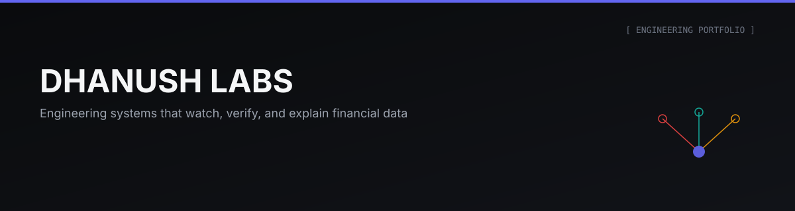

### Hi, I'm Dhanush — I build systems that watch, verify, and explain financial data.

I'm an engineer who cares more about what a system gets *wrong* than what it gets right on the happy path. Every project below is built around the same discipline: measure instead of claim, write down every judgment call, and report the finding even when it isn't flattering.

---

## How I Build

> [!IMPORTANT]
> Every product in this portfolio shares one engineering standard, not just a visual one: ground truth over guesses, documented trade-offs over silent defaults, and negative results reported instead of buried.

This shows up as a shared design system across every repository — same color language, same section structure, same documentation depth — so each product reads as **one engineer's work**, not a pile of unrelated side projects.

## Products

| | Product | What it does | Stack |
|---|---|---|---|
| 🔴 | **[LaunderLab](https://github.com/Dhanu2626/LaunderLab)** | An open adversarial simulation range for AML detection — a synthetic bank, six laundering typologies, a four-layer detection stack, and a red team that adapts generation over generation. | Python · DuckDB · FastAPI |
| 🟢 | **[RefundRadar](https://github.com/Dhanu2626/RefundRadar)** | A local-first payments auditor that applies RBI's failed-transaction circular as code and computes exactly what your bank owes you. | Python · pandas |
| 🟡 | **[Spendly](https://github.com/Dhanu2626/-spendly)** | An early-stage personal finance platform exploring Flask architecture and expense-tracking workflows. Actively under development. | Flask · Werkzeug |

## Tech Stack

## Currently

Reproducing every measured result in LaunderLab down to reproducible commands, extending RefundRadar's bank-format coverage, and bringing Spendly's core expense flows online.

## Contact

Dhanush Jangadi — [GitHub](https://github.com/Dhanu2626) · [LinkedIn](https://www.linkedin.com/in/jangadidhanush)

---

Dhanush Labs · engineering systems that watch, verify, and explain

